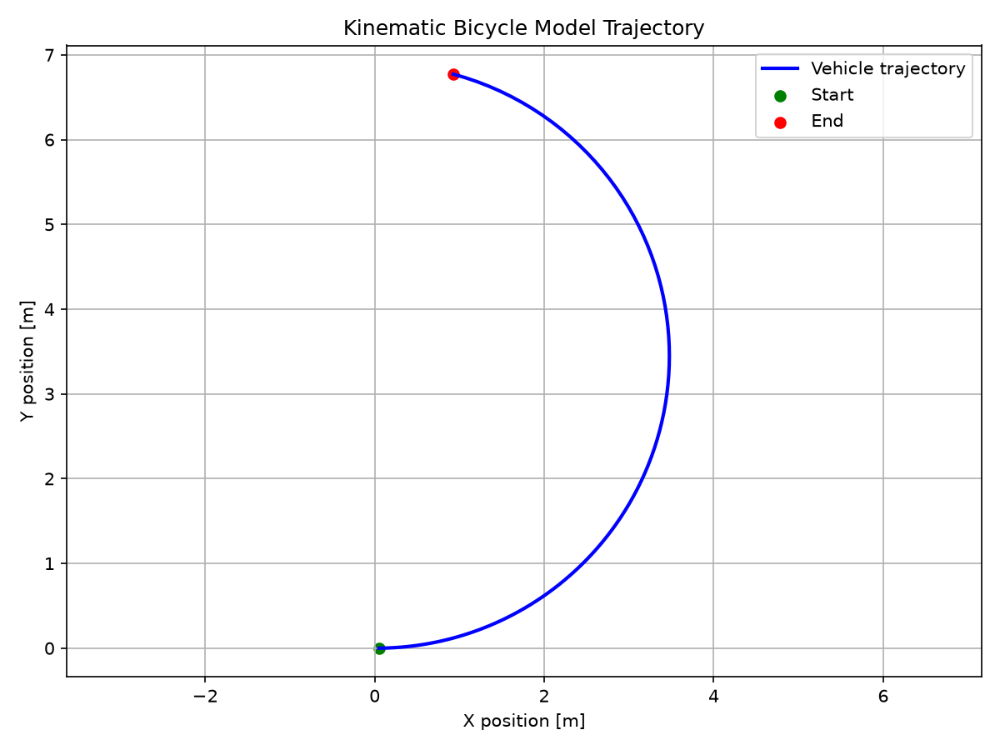
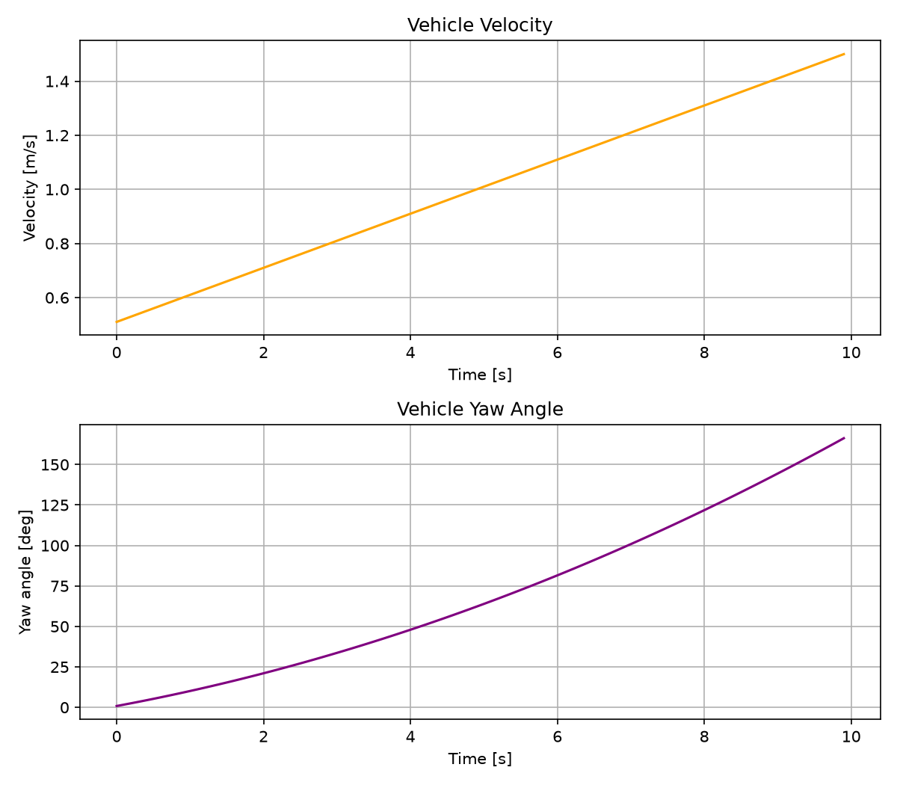

# Wheeled Robot Control Lab

This repository documents an independent research project on wheeled mobile robots, vehicle modeling, and path-tracking control.

The goal is to build a research-oriented portfolio for graduate study in mechanical engineering, robotics, and autonomous mobility.

## Research Question

> How can a small wheeled vehicle follow a desired path accurately and stably?

The project progresses from mathematical modeling and Python simulation to controller comparison and small-scale vehicle experiments.

## Current Progress

* [x] Document the research motivation
* [x] Study the kinematic bicycle model
* [x] Implement the bicycle model in Python
* [x] Record position, yaw, and velocity histories
* [x] Visualize the vehicle trajectory
* [x] Save simulation results as images
* [ ] Generate a reference path
* [ ] Calculate path-tracking error
* [ ] Implement Pure Pursuit control
* [ ] Implement Stanley control
* [ ] Compare controller performance
* [ ] Build an RC-car experimental platform

## Implemented Model

The current simulation uses a kinematic bicycle model with the following state variables:

* `x`: longitudinal position
* `y`: lateral position
* `yaw`: vehicle heading angle
* `v`: vehicle velocity

The control inputs are:

* Acceleration
* Steering angle

The state is updated using explicit Euler integration.

## Simulation Results

### Vehicle Trajectory



### Velocity and Yaw History



The current experiment applies constant acceleration and a constant steering angle. The result shows a curved vehicle trajectory with increasing velocity and yaw angle.

## How to Run

Install Matplotlib:

```bash
python -m pip install matplotlib
```

Run the simulation:

```bash
python simulation/bicycle_model.py
```

For a headless environment such as GitHub Codespaces:

```bash
MPLBACKEND=Agg python simulation/bicycle_model.py
```

The generated plots are saved in:

```text
assets/plots/
├─ trajectory.png
└─ state_history.png
```

## Repository Structure

```text
wheeled-robot-control-lab/
├─ README.md
├─ docs/
│  ├─ 001-research-motivation.md
│  └─ 002-vehicle-modeling.md
├─ simulation/
│  └─ bicycle_model.py
└─ assets/
   └─ plots/
      ├─ trajectory.png
      └─ state_history.png
```

## Next Step

The next experiment will generate a reference path and calculate the lateral tracking error between the desired path and the simulated vehicle position.

After that, Pure Pursuit and Stanley controllers will be implemented and compared under the same conditions.

## References

* [Kinematic Bicycle Model](https://thomasfermi.github.io/Algorithms-for-Automated-Driving/Control/BicycleModel.html)
* [Matplotlib documentation](https://matplotlib.org/stable/)
* [Python math module](https://docs.python.org/3/library/math.html)
